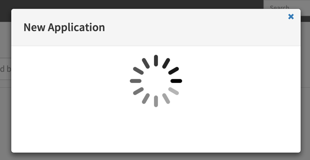

* Table of contents. This line is required to start the list.
{:toc}

# Troubleshooting Guide

## General Troubleshooting Procedures
The following steps show a typical set of diagnostic instructions for tracking down Spinnaker issues. 

Let's say you have a screen in Spinnaker that is misbehaving. Here, we see that when I click on create application, the screen is stuck in an endless spinner. 

### Check browser developer console ###
The first thing to always do is to check the browser developer console. This will usually give you a clue to the type of issue you are seeing. In Chrome, you can access this via `View > Developer > Developer Tools`.

Start with the Console tab to see if there are any JavaScript errors that are causing grief. Any errors here would be in the Deck service.  

Network tab and see if there are any connectivity issues or any services returning a non-200 http response. 
.

The following table shows a list of services and the port they are traditionally bound to in the Spinnaker configuration files. 

| Service | Port |   
|---------|------|
|Deck| 9000|
|Clouddriver  |7002  |
|Echo  |8089  | 
|Front50  | 8080  |
|Gate|8084|
|Igor|8088|
|Orca|8083|
|Rosco|8087|
|Rush|8085|

### Check Service Logs ###

If you have identified a service, you can check the service logs.

If you used one of the pre-baked Spinnaker machine images or installed Spinnaker from the .deb files, each subsystem will write its logs to:

`/var/log/spinnaker/{service}/{service}.log`

For example:

`/var/log/spinnaker/clouddriver/clouddriver.log`

`/var/log/spinnaker/orca/orca.log`

`/var/log/spinnaker/rosco/rosco.log`

### Check Spinnaker API ###

Spinnaker provides a swagger endpoint available through Gate (8084). All of the Spinnaker UI goes through this API. The endpoint is useful if you wish to try passing different variables to your requests to test out variables and isolate problems.

To access the API, go to http://{gate service url}/swagger/index.html ( for example [http://localhost:8084/swagger/index.html](http://localhost:8084/swagger/index.html) )

###Check Health / Config endpoints###

Most Spinnaker services have a health check endpoint configured. Sometimes this can provide useful information in terms of visualizing service health. To see if there is any information available, click on http://{service url}/health (e.g, [http://localhost:8084/health](http://localhost:8084/health)).

Sometimes issues arise from incorrectly set environment variables or configuration files. You can see configurations available by clicking on http://{service url}/env (e.g, [http://localhost:8084/env](http://localhost:8084/env)), which will provide a dump of the service environment. 

There are a few other endpoints available. A list is available on the [Spring Boot Actuator Endpoints documentation](http://docs.spring.io/spring-boot/docs/current-SNAPSHOT/reference/htmlsingle/#production-ready).

## I can't create an Application.
This can manifest as either an endless spinner or as an error message rendered at the bottom of the Create Application dialog.

The Spinnaker service responsible for creating applications is [front50](https://github.com/spinnaker/front50). It "creates" an application by adding a row to Cassandra. The first place to look is in `/var/log/spinnaker/front50/front50.log`. If you see a bunch of stack traces with references to `astyanax`, we're on the right track. The problem is that when Cassandra is upgraded, it can sometimes disable the thrift server. So we're going to first see if Cassandra is available at all, and then we'll check if thrift is enabled.

1. Check if Cassandra is available via `cqlsh`. If you can connect to the cluster, Cassandra is installed and available.

1. Check if Cassandra has thrift enabled via `curl localhost:9160`. If you get a connection refused, thrift is not enabled (as opposed to an 'empty reply').

1. Enable thrift via this command: `nodetool enablethrift`.

1. Make this setting durable by editing `/etc/cassandra/cassandra.yaml`. Find the `start_rpc` flag and set it to `true`.

Thrift should now be enabled. Execute `curl localhost:9160` and verify that you receive an 'empty reply'.

The last step is to restart the two Spinnaker services that require Cassandra to be available on startup: `sudo service front50 restart` and `sudo service echo restart`.

We will be making front50 and [echo](https://github.com/spinnaker/echo) more tolerant of an unavailable or misconfigured Cassandra cluster on startup shortly.

## I changed my configuration. How do I get Spinnaker to pick up the modified configuration?
*Note: This section is useful mainly for operators who either used one of the pre-baked Spinnaker machine images or installed Spinnaker from the .deb files (usually on an AWS or GCE VM). If doing development locally, you can probably skip this section.*

There are various ways you can modify your configuration:
* Re-running `InstallSpinnaker.sh`
* Editing `/etc/default/spinnaker`
* Editing one of the `.yml` files (e.g. `/opt/spinnaker/config/spinnaker-local.yml`, `/opt/spinnaker/config/clouddriver.yml`, `/opt/rosco/config/rosco.yml`)
* Modifying environment variables
* Modifying `~/.aws/credentials`

If you've modified your configuration via any of those methods, the simplest way to have Spinnaker synchronize your configuration is to run these two commands:

\# Restart all Spinnaker services

`sudo restart spinnaker`

\# Update Deck (the browser application) settings

`sudo /opt/spinnaker/bin/reconfigure_spinnaker.sh`

You can also restart individual Spinnaker services:

`sudo service restart {service-name}`

For example, the two services that typically need to be restarted to pick up account-related changes can be restarted with these commands:

`sudo service restart clouddriver`

`sudo service restart rosco`

Clouddriver also exposes an entrypoint that can be used to refresh its account lists dynamically:

`curl -X POST localhost:7002/config-refresh`

But for the sake of simplicity and repeatability, the safest path is usually the coarse-grained `sudo restart spinnaker`.

## Why can't I access Spinnaker using my machine's IP addr or hostname?
*Note: This section is useful mainly for operators who either used one of the pre-baked Spinnaker machine images or installed Spinnaker from the .deb files (usually on an AWS or GCE VM). If doing development locally, you can probably skip this section.*

There is no authentication on the services so they are currently bound to localhost (since the services have admin access to your environment).

A few ways you can remove this restriction:

1. Edit `/etc/apache/ports.conf` and change `Listen 127.0.0.1:9000` to `Listen 9000`
1. Add a reverse proxy for ports you wish to open in Apache
1. Edit config files in `/opt/spinnaker/conf` to disable the bind to `localhost`. Change `localhost` to domain name or `0.0.0.0`
