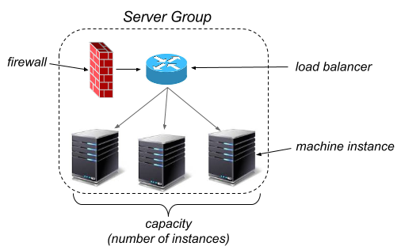
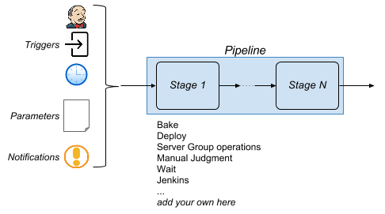

* Table of contents. This line is required to start the list.
{:toc}

# Overview

Spinnaker is an open source, multi-cloud continuous delivery platform
for releasing software changes with high velocity and confidence.

It provides two core sets of features: *cluster management* and
*deployment management*. Below we give a top-level overview of these
features.

Please come back soon, as we plan to add more details in the coming
weeks.

## Cluster Management

Spinnaker's cluster management features are used to manage
resources in the cloud.

* **Server Group**: The base resource to be managed is the *Server
Group*. A Server Group identifies the machine instance profile on
which to execute images along with the number of instances, and is
associated with a Load Balancer and a Security Group. A Server Group
is also identified with basic configuration settings, such as user
account information and the region/zone in which images are
deployed. When deployed, a Server Group is a collection of virtual
machines running software.

* **Security Group**: A *Security Group* defines network traffic
    access. It is effectively a set of firewall rules defined by an IP
    range (CIDR) along with a communication protocol (e.g., TCP) and
    port range.
* **Load Balancer**: A *Load Balancer* is associated with an ingress
    protocol and port range, and balances traffic among instances in
    the corresponding Server Group. Optionally, you can enable health
    checks for a load balancer, with flexiblity to define health
    criteria and specify the health check endpoint.
* **Cluster**: A *Cluster* is a user-defined, logical grouping of
    Server Groups in Spinnaker.

## Deployment Management

Spinnaker's deployment management features are used to construct and
manage continuous delivery workflows.

* **Pipeline**: *Pipelines* are the key deployment management
    construct in Spinnaker. They are defined by a sequence of stages,
    along with automated triggers (optional) that kick off the
    pipeline, parameters that get passed to all stages in the
    pipeline, and can be configured to issue notifications as the
    pipeline executes.  Automatic triggers can be a Jenkins job,
    a CRON schedule, or another pipeline. You can also manually start
    a pipeline. Notifications can be sent out to email, SMS or HipChat
    on pipeline start/complete/fail.

* **Stage**: A *Stage* in Spinnaker is an atomic building block for a
    pipeline. Stages in a Pipeline can be sequenced in any order,
    though some stage sequences may be more common than
    others. Spinnaker comes pre-packaged with a number of stages,
    including:
  * **Bake**: Bakes an image in the specified region.
  * **Deploy**: Deploys a previously baked or found image.
  * **Destroy Server Group**: Destroys a server group.
  * **Disable Server Group**: Disables a server group.
  * **Enable Server Group**: Enables a server group.
  * **Find Image**: Finds a previously-baked image to deploy into an existing cluster.
  * **Jenkins**: Runs a Jenkins job.
  * **Manual Judgment**: Waits for user approval before continuing.
  * **Modify Scaling Process**: Suspend or resume server group scaling processes.
  * **Pipeline**: Runs a pipeline. This allows pipelines to be composed hierarchically.
  * **Quick Patch Server Group**: Quick patches a server group. Used for emergency patches.
  * **Resize Server Group**: Resizes a server group.
  * **Script**: Runs an arbitrary shell script.
  * **Shrink Cluster**: Shrinks a cluster.
  * **Wait**: Waits a specified period of time.
